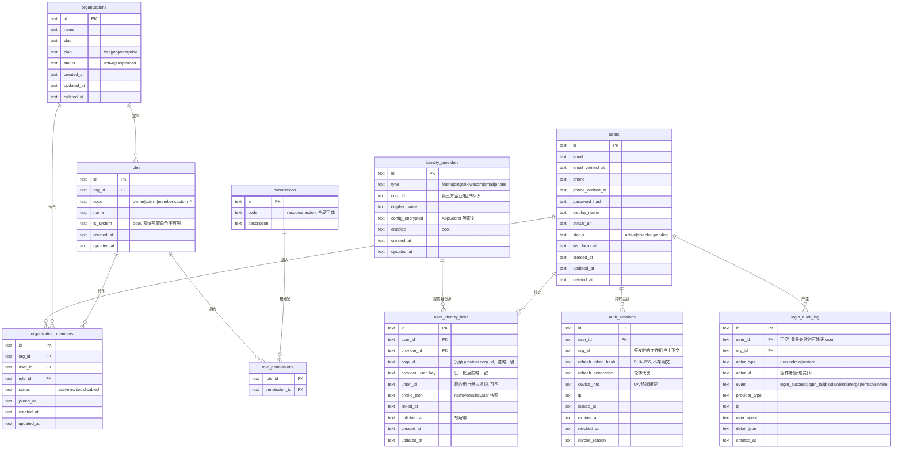

# 01 · 数据模型（ER）

> 目标：新 SaaS 产品拷贝本模块即可获得完整的「用户 + 多租户组织 + RBAC + 第三方身份 + 会话 + 审计」模型。
> 约定：所有主键为 UUID（TEXT 存储）；时间统一 UTC ISO8601；删除一律软删（`deleted_at`）除非特别说明。

## ER 图



## 逐表设计说明

### users — 自然人账户（全局唯一，不含任何租户角色）

| 字段 | 类型 | 约束 | 说明 |
|---|---|---|---|
| id | TEXT | PK | UUID |
| email | TEXT | 普通索引（非唯一，见下） | 登录标识之一 |
| email_verified_at | TEXT | 可空 | 未验证不允许密码登录 |
| phone | TEXT | 普通索引 | 登录标识之一 |
| phone_verified_at | TEXT | 可空 | |
| password_hash | TEXT | 可空 | Argon2id；纯第三方注册用户可空 |
| display_name / avatar_url | TEXT | | 注册时由 normalizeProfile 回填，用户可改 |
| status | TEXT | | `disabled` 时网关层直接拒绝 |
| last_login_at / created_at / updated_at / deleted_at | TEXT | | |

**为什么 email/phone 不做全局唯一约束**：user 是自然人粒度，同一邮箱理论上只应有一个 user，但在「合并」发生前可能短暂存在重复。唯一性由**业务层**在注册时保证（查重 + 冲突时引导登录已有账号），DB 层只做索引加速查重。若你的产品不需要合并流程，可以直接加 `UNIQUE(email)`。

### organizations / organization_members — 租户与成员

- `organizations.slug`：`UNIQUE`，用于子域名/URL 路由解析租户。
- `organization_members`：`UNIQUE(org_id, user_id)` —— 一个人在同一组织只有一条成员记录；`INDEX(user_id)` 用于「我加入了哪些组织」；`INDEX(org_id, status)` 用于成员列表分页。
- `role_id`：成员在**该组织内**的角色。**这是全库唯一挂载角色的地方**，users 表无角色字段，杜绝「全局角色」。

### roles / permissions / role_permissions — RBAC

- `roles`：`UNIQUE(org_id, code)`。系统预置角色（owner/admin/member）在每个组织创建时拷贝一份（`is_system=1`），**不做全局共享角色表**——这样租户可以改预置角色的权限而互不影响。拷贝比共享多一行数据，换隔离性，值得。
- `permissions`：全局权限字典，`UNIQUE(code)`，格式 `resource:action`（如 `doc:read`、`billing:write`）。模块自带基础集合，产品侧扩展。
- `role_permissions`：复合主键 `(role_id, permission_id)`，无独立 id。

### identity_providers — 身份源配置（密钥加密落库）

| 字段 | 说明 |
|---|---|
| type | `feishu / dingtalk / wecom / email / phone`，后两者是内置身份源，统一走同一套 link 逻辑 |
| corp_id | 第三方侧的企业标识（飞书 tenant_key、钉钉/企微 corpId）。邮箱/手机源为空串 |
| config_encrypted | JSON 密文：`{appId, appSecret, agentId, encryptKey...}`，envelope 加密，见 07 安全清单 |

约束：`UNIQUE(type, corp_id)` —— 同一企业的同一平台只配置一次；`INDEX(enabled)` 供登录页列可用登录方式。

### user_identity_links — 核心：身份映射表

```sql
UNIQUE(provider_id, corp_id, provider_user_key)
INDEX(user_id) WHERE unlinked_at IS NULL   -- 查某 user 当前有效绑定
INDEX(union_id)                             -- 跨应用同人识别（辅助，不参与唯一）
```

**`(provider_id, corp_id, provider_user_key)` 唯一是本模块最重要的一条约束**，理由：

1. `provider_user_key` 是 `normalizeProfile()` 归一化后的平台侧用户 ID（飞书 open_id / 钉钉 unionid 或 userid / 企微 userid）。**同一个 key 在不同 corp 下可能指向不同自然人**（如企微 userid 仅企业内唯一），所以 corp_id 必须进唯一键。
2. `provider_id` 进键是因为同一 corp 可能同时配置同 type 的多个应用（如飞书自建应用 A/B），open_id 按应用隔离。
3. 有此唯一约束兜底，「code 换身份 → 查 link」的竞态（两个浏览器同时首次登录同一第三方账号）最坏结果是后到的 INSERT 冲突 → 转为「绑定冲突」错误提示，而**不会**产生两条映射。

`unlinked_at` 软解绑：解绑置时间戳而非 DELETE，保留审计追溯；唯一约束需用**部分唯一索引**（SQLite/Postgres 均支持）：

```sql
CREATE UNIQUE INDEX uq_identity_link
  ON user_identity_links(provider_id, corp_id, provider_user_key)
  WHERE unlinked_at IS NULL;
```

这样同一第三方账号解绑后还能再绑定，不撞唯一键。

### auth_sessions — refresh_token 的落地形态（可轮转、可吊销）

- `refresh_token_hash`：客户端拿到的 refresh_token 是 `sid + "." + secret`，服务端只存 SHA-256(secret)。泄库不泄令牌。
- `refresh_generation`：每次轮转 +1。客户端拿旧 token 来刷新时，哈希能对上某一代则**判定为令牌重放** → 整条会话链吊销（见 07）。
- `expires_at`：7 天，到期即死，不续命（续命靠轮转）。
- `revoked_at` + `revoke_reason`：封禁/改密/解绑时批量置位，网关查 access_token 的 `sid` 时对已吊销会话可直接拒绝（可选严格模式）。

索引：`INDEX(user_id, revoked_at)`（列出/吊销某用户全部会话）、`INDEX(refresh_token_hash)`（刷新时定位）。

### login_audit_log — 只追加，不更新

- `event` 覆盖：`login_success / login_fail / token_refresh / bind / unbind / merge / admin_unbind / revoke / register`。
- `actor_type = admin` 时 `actor_id` 记录操作的管理员，`user_id` 记录被操作的成员——满足「管理员解绑需审计」。
- 索引：`INDEX(user_id, created_at)`（个人登录历史）、`INDEX(org_id, created_at)`（管理员按组织查）、`INDEX(ip, created_at)`（风控聚合）。

## 关键取舍记录

| 取舍 | 决定 | 理由 |
|---|---|---|
| user 是否带租户 | 不带，靠 organization_members | 一人多租户是 B2B 常态 |
| 角色是否全局 | 否，角色挂在 member 上 | 需求硬约束 |
| 解绑是否物理删 | 否，软删 + 部分唯一索引 | 审计可追溯 + 可重复绑定 |
| refresh_token 是否落库 | 落哈希 | 可吊销是硬需求，纯无状态 JWT 做不到即时吊销 |
| 密码登录与第三方登录 | 统一走 user_identity_links（email/phone 也是 provider） | 一套代码路径，绑定/解绑规则天然复用 |
