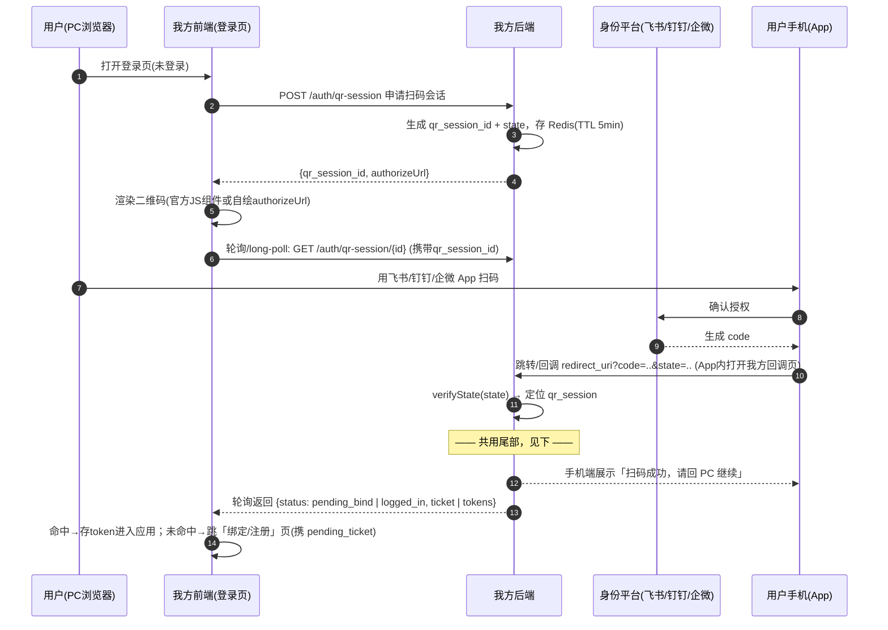
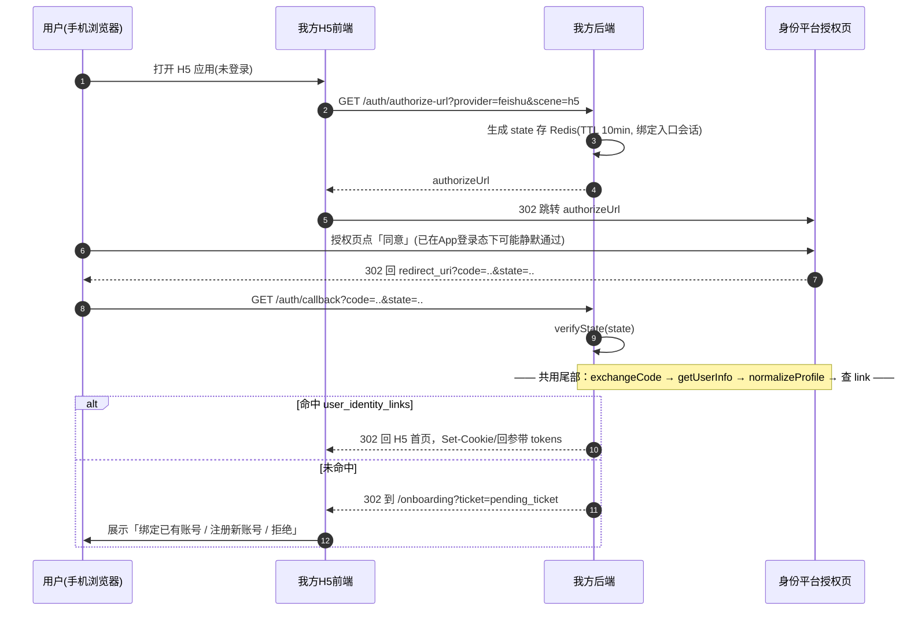
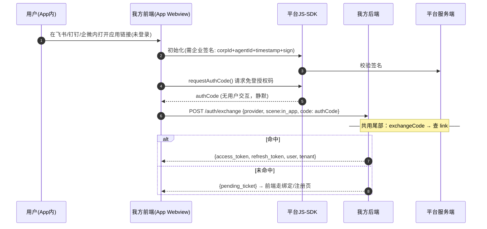
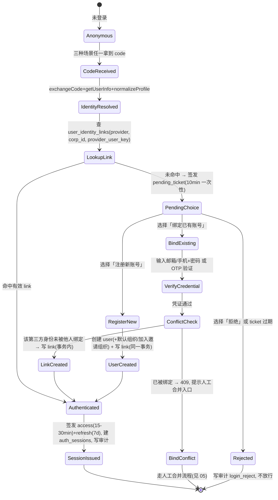

# 04 · 终端场景时序与登录状态机

> 三个场景的前段各不相同，**尾部完全共用**：`code → 服务端换身份 → 查 user_identity_links → 命中登录 / 未命中三分支`。
> pending_ticket：未命中时签发的短期（10min）一次性凭证，只承载归一化 profile，**不是登录态**，用于走完「绑定/注册」流程后换取正式 token。

## 场景一：PC 网页扫码

要点：
- 二维码有两种渲染方式（平台 JS 组件内嵌 vs 自绘授权 URL 二维码），对后端无差别，后端只认回调 code。
- 轮询建议 long-poll（30s 超时）或 WebSocket；纯短轮询给 `/auth/qr-session` 加限流。
- qr_session 五状态：`waiting → scanned(可选) → confirmed | expired | consumed`，code 兑换成功后置 consumed，防重放。

## 场景二：手机 H5 授权页

要点：H5 与 PC 跳转授权本质同一链路，只是入口在移动端；state 必须绑定发起会话（cookie/sessionId），回调时校验，防登录 CSRF。

## 场景三：客户端内打开链接（免登）

要点：
- 免登场景**无跳转、无二维码**，前端 JS-SDK 直接拿 authCode——`buildAuthorizeUrl` 在此场景返回 null，前端走 SDK 路径。
- 钉钉 in_app 的 code 兑换通道与网页 OAuth2 **不同**（见 03 差异表），Adapter 内部按 scene 分流。
- SDK 签名所需 secret 绝不进前端，由后端 `/auth/js-signature` 按需签发。

## 共用尾部：身份决策状态机

### 状态机落地规则

1. **命中即登录**：`LookupLink → Authenticated` 之间要做两项校验——user.status 必须 active；若 link 所在 corp 配置了「仅组织成员可登录」，校验该 user 在对应 org 有 active member 记录。
2. **pending_ticket 是一次性的**：绑定或注册任一完成后即作废；TTL 10min；承载内容仅为归一化 profile + provider 三元组，签 JWT（短密钥，独立密钥对，与正式 token 密钥分离）。
3. **LinkCreated / UserCreated 必须在单事务内完成**：建 link 撞唯一约束（并发同身份）时整个事务回滚，转 BindConflict。
4. **每个终态都写 login_audit_log**：成功、失败、拒绝、冲突各一条，字段见 01。
5. **「拒绝」分支不是删数据**：只是不发令牌。用户的第三方授权关系在平台侧，我方不主动调平台解绑 API（平台差异大且无必要）。
