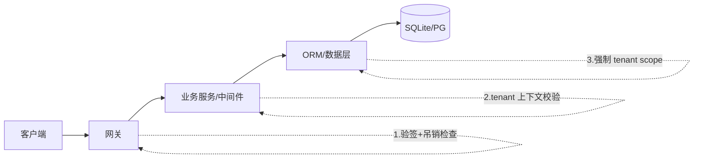

# 06 · 租户解析与隔离

> 硬约束：**不存在「user 全局角色」**。user 是自然人，角色只存在于 `organization_members.role_id`（某人在某组织内的角色）。所有鉴权必须携带租户上下文。

## JWT 设计

### access_token claims

```json
{
  "sub":  "user-uuid",               // 自然人
  "tid":  "org-uuid",                // tenant_id：本次会话的工作租户
  "roles": ["admin"],                // 该用户在【该租户内】的角色 code 列表
  "perms": ["doc:read", "billing:write"],  // 展开后的权限（可选，大权限集则网关查缓存）
  "sid":  "session-uuid",            // 关联 auth_sessions.id，用于吊销检查
  "iat":  1755300000,
  "exp":  1755301800                 // 15–30min
}
```

设计决策：

- **一个 token 只绑定一个租户**。用户加入多个组织时，登录后签发「当前租户」的 token；切换组织走 `POST /auth/switch-tenant {org_id}` 接口——校验 membership 存在且 active 后**重签 token**（新 tid/roles，sid 不变或新开会话均可）。这避免了 token 里塞多租户角色导致的鉴权歧义。
- `perms` 内嵌 vs 网关反查：权限 < ~50 条时内嵌（网关零依赖）；权限体系庞大时只放 roles，网关注入权限缓存（Redis，角色变更时主动失效）。二选一，全产品统一。
- refresh_token **不含** tid/roles，只含 sub+sid；刷新时用 sid 找到会话，重新读当前 membership 生成新 access_token——角色变更（被降权）在下一次刷新即生效，最坏窗口 = access_token 剩余寿命（≤30min）。要求立即生效的场景（封禁/解绑）走会话吊销，见 07。

### 密钥

- 签名用 RS256/ES256（非对称）：私钥只在身份服务，网关与各服务持公钥验签——**私钥不出身份服务**是本模块的重要边界。
- 密钥轮换：JWKS endpoint 发布公钥集，kid 头定位。

## 三层隔离（每层都过滤，不信任上游）



### 第 1 层：网关

- 验签（公钥）+ exp + user.status 缓存检查（可选严格模式查 sid 吊销态）。
- 从 claims 提取 `sub / tid`，注入请求头 `X-User-Id` / `X-Tenant-Id` 传给下游（内网边界内可信）；**客户端自传的同名头必须剥掉**，防伪造。
- URL 中的 orgId（如 `/orgs/{orgId}/docs`）与 token 的 tid 不一致 → 直接 403。**路径租户和 token 租户必须同源**。

### 第 2 层：业务中间件（NestJS Guard / Python middleware）

- 每个请求构造 `TenantContext { userId, tenantId, roles }`，从网关注入头读取，**贯穿整个请求生命周期**（AsyncLocalStorage / contextvars）。
- 权限校验装饰器 `@RequirePerm('doc:read')` 只认 TenantContext 里的 roles/perms，不重新查库信任客户端输入。

### 第 3 层：ORM 强制 scope

即使业务代码忘了加 `WHERE org_id = ?`，数据层也要兜底。Prisma 示例（extension 方式）：

```typescript
// 所有带 orgId 字段的模型，自动注入租户过滤
const tenantScoped = (tenantId: string) => Prisma.defineExtension({
  query: {
    $allModels: {
      async $allOperations({ model, operation, args, query }) {
        if (TENANT_SCOPED_MODELS.has(model) && !args.__skipTenantScope) {
          args.where = { ...args.where, orgId: tenantId };
        }
        return query(args);
      },
    },
  },
});

// 每个请求创建独立 client 实例（或 AsyncLocalStorage 注入）
const prisma = basePrisma.$extends(tenantScoped(ctx.tenantId));
```

`__skipTenantScope` 的唯一合法使用者是**服务账号**（见下）。裸 SQL 查询不在此保护内——代码评审清单里写明「裸 SQL 必须手工带 org_id 条件」。

## 跨租户操作的唯一合法通道：服务账号

- 内部服务间调用（如「向全员发通知」「计费汇总」）使用**服务账号 token**：`aud=internal`，claim 无 tid，网关只放行到内网端口。
- 服务账号代码路径与租户代码路径**物理分离**（独立 Guard 标注 `@ServiceAccountOnly`），任何 handler 不能两者皆可。
- 服务账号的每次跨租户数据访问写审计（event=system, detail 记租户范围）。

## 防绕清单（评审 checklist 用）

- [ ] 不存在任何接口从请求 body/query 接受 `userId`/`orgId` 作为权限依据（只能取自 TenantContext）
- [ ] 不存在「role 在 users 表上」的残留设计（DB 层已杜绝：users 无 role 字段）
- [ ] 网关剥掉客户端自传的 X-User-Id / X-Tenant-Id
- [ ] 切换租户接口校验目标 org 的 membership
- [ ] 管理接口二次校验路径 orgId == token tid
- [ ] 裸 SQL 语句逐一审查 org_id 条件
- [ ] 权限缓存（如启用）在角色变更、member 禁用、合并时主动失效
